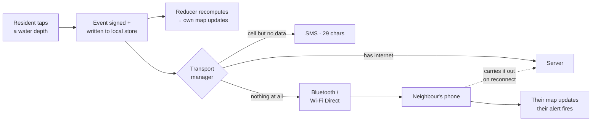
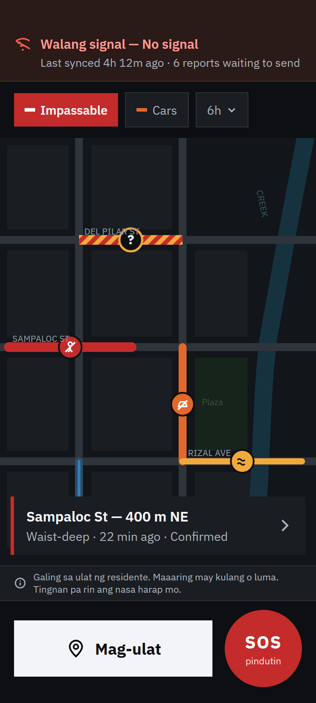
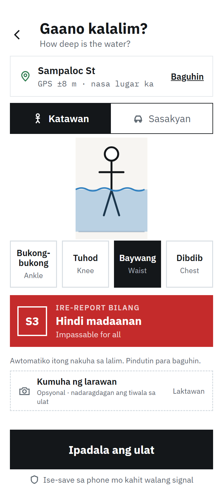
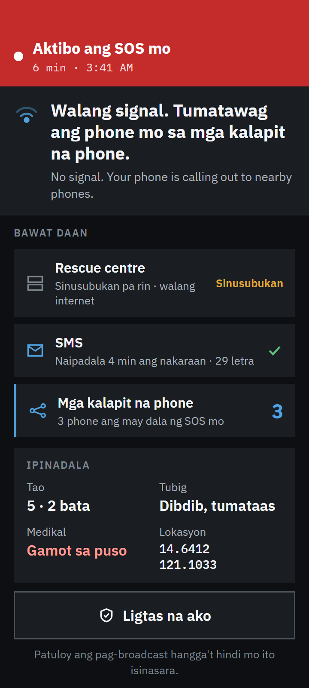

<div align="center">

# KaAlerto

**A community flood map and rescue channel for Philippine barangays — built to keep working when the network doesn't.**

Team MACCI · Climate Resilience and Hydrometeorological Disaster Management

</div>

---

## The trick

Every flood app dies when the towers do. This one doesn't.

The Philippines takes about twenty typhoons a year, and when a severe one lands the cell towers congest or fall — which is exactly the hour a warning matters most. Every cloud-based early-warning app goes dark at that moment. KaAlerto is built the other way round.

**The phone is the source of truth.** It holds its own copy of the data and computes its own map. The server aggregates and accelerates; it never decides what's true. In a normal app the phone asks the server what's happening — here the phone already knows, and the server exists to help phones learn about each other.

- **Three transports, tried in order.** Server sync, then SMS, then phone-to-phone over Bluetooth and Wi-Fi Direct. The relay only has to reach *one* connected phone — someone driving to higher ground carries the whole neighbourhood's data out with them.
- **A deterministic reducer.** Two devices holding the same events display the same map. That's what makes an offline phone trustworthy rather than merely stale.
- **Notifications fire locally.** Every device evaluates its own geofences on every event it receives. No push server, no signal, alerts still fire.
- **Reporting takes about fifteen seconds and no typing.** Tap a location, tap a depth on a body scale — ankle, knee, waist, chest. Severity is derived, not chosen.
- **No forecasting.** Every condition on the map was observed by a person who was standing there. This carries warnings; it does not predict them.

> **Put the phone in airplane mode and it still works.** That's the whole claim, and it's the first thing the demo does.

---

## The flow



The report is useful the instant it's written — before any transmission is attempted. Everything after that is delivery, and delivery degrades in fidelity rather than switching off.

**What that looks like end to end:**

1. Phone A files a report in airplane mode. It appears on A's own map immediately.
2. Phone B receives it over Bluetooth — no internet, no cell service, no server.
3. Phone C receives it *via B*, which was never in range of A. That's the relay carrying.
4. Two neighbours disagree about a road: the map shows the disagreement and treats it as dangerous, rather than averaging them or picking a winner.
5. Someone long-presses SOS. A responder two streets away gets a critical alert and acknowledges — and the acknowledgement returns down the same chain to a phone that has never had a signal.
6. One person reaches signal. Everyone's queued data uploads at once, and the LGU dashboard finally sees the night the barangay just had.

---

## Screenshot

| Map · Storm mode | Report | SOS status |
|:---:|:---:|:---:|
|  |  |  |
| Offline, with six reports queued. Red is impassable, orange means cars can't pass, the hatched marker is a road neighbours disagree about. | Tap a depth on the body scale. Severity is derived automatically — no typing, no numbers. | Every transport shown honestly: SMS delivered, three nearby phones carrying it, rescue centre still unreachable. |

All 29 screens across Normal, Storm and Survival modes are in [`design/`](design/) — see the [screen index](design/README.md).

---

## Try it

**There's no build yet.** Version 0 lands **19 September 2026**; this repo currently carries the idea, the PRD and the hi-fi design.

In the meantime:

- **[Browse the full design canvas →](https://claude.ai/code/artifact/f1ee7d2c-1462-4788-bb92-5ed9b289f84a)** — all 29 artboards on one pan-and-zoom canvas
- **[Browse the screens →](design/)** — 29 artboards with a full screen index

The PRD, architecture and build plan are submitted as documents at each stage rather than kept in the repository.

Once V0 ships, this section becomes:

```
1. Download the APK from the latest release
2. Sideload it (Settings → allow install from unknown sources)
3. Grant location, nearby devices, and SMS permissions
4. Turn on airplane mode, then use it — that's the point
```

---

## More

[Design canvas](https://claude.ai/code/artifact/f1ee7d2c-1462-4788-bb92-5ed9b289f84a) · [Screens](design/) · [Submissions](submissions/)

<sub>Android · Kotlin + Jetpack Compose · MapLibre · Nearby Connections · Room. Server: Node + Express + <code>node:sqlite</code>.</sub>
