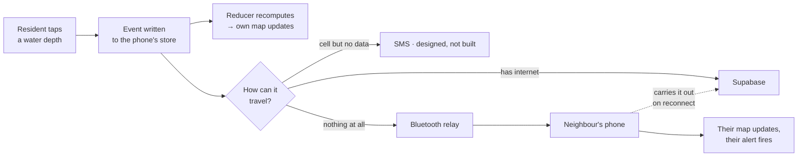

# KaAlerto

**A community flood map and rescue channel for Philippine barangays — built to keep working when the network doesn't.**

Team MACCI · Climate Resilience and Hydrometeorological Disaster Management

**[Download v1 (Android APK)](https://github.com/afjk-x3/ka-alerto/releases/tag/stage-4-v1)** · **[LGU dashboard](https://kaalerto.vercel.app/)**

---

## The trick

Every flood app dies when the towers do. This one doesn't.

The Philippines takes about twenty typhoons a year, and when a severe one lands the cell towers congest or fall — which is exactly the hour a warning matters most. Every cloud-based early-warning app goes dark at that moment. KaAlerto is built the other way round.

**The phone is the source of truth.** It holds its own copy of the data and computes its own map. The cloud (Supabase) aggregates and accelerates; it never decides what's true. In a normal app the phone asks the server what's happening — here the phone already knows, and the cloud exists to help phones learn about each other.

- **Two transports are built.** Internet sync, and phone-to-phone relay over Bluetooth (low power). The relay only has to reach *one* connected phone — someone driving to higher ground carries the whole neighbourhood's data out with them. **SMS is designed but not built:** sending SMS costs money on every message, so the app carries only a placeholder and says so on the SOS screen.
- **A deterministic reducer.** Two devices holding the same events display the same map. That's what makes an offline phone trustworthy rather than merely stale.
- **Notifications fire locally.** Every device evaluates its own alert areas on every event it receives. No push server, no signal, alerts still fire.
- **Reporting takes about fifteen seconds and no typing.** Tap a location, tap a depth on a body scale — ankle, knee, waist, chest. Severity is derived, not chosen.
- **No forecasting.** Every condition on the map was observed by a person who was standing there. PAGASA's own advisories are relayed word for word, never blended in.

> **Put the phone in airplane mode and it still works.** That's the whole claim, and it's the first thing the demo does.

---

## The flow

The report is useful the instant it's written — before any transmission is attempted. Everything after that is delivery, and delivery degrades in fidelity rather than switching off.

**What that looks like end to end:**

1. Phone A files a report in airplane mode. It appears on A's own map immediately.
2. Phone B receives it over Bluetooth — no internet, no cell service, no server.
3. Two neighbours disagree about a road: the map shows the disagreement and treats it as dangerous, rather than averaging them or picking a winner.
4. Someone holds SOS. A responder nearby gets a critical alert and acknowledges — and the acknowledgement returns down the same chain to a phone that has never had a signal.
5. One person reaches signal. Everyone's queued data uploads at once, and the LGU dashboard finally sees the night the barangay just had.

Steps 1, 2 and 4 were proven on two real phones. Relay across a third phone (A to C through B) is built but has not yet been shown on real hardware.

---

## Try it

1. Download **kaalerto-v1.apk** from the [v1 release](https://github.com/afjk-x3/ka-alerto/releases/tag/stage-4-v1). Uninstall any earlier KaAlerto first; it was signed with a different key.
2. Sideload it (Settings → allow installs from unknown sources) and open it **once with internet** so the offline map of Pangasinan downloads (about 18–24 MB).
3. Allow location, notifications and nearby devices, and register.
4. Turn on airplane mode, turn Bluetooth and Location back on, and use it — that's the point.

The **[LGU dashboard](https://kaalerto.vercel.app/)** is behind a shared demo PIN, given in the user manual submitted with the entry.

**Built:** offline flood map, reporting with confirm / dispute / withdraw, local alerts near home and on saved routes, SOS with acknowledgement and a rescue card, Bluetooth relay, cloud sync, official status, evacuation centres, family circles, PAGASA advisories, online and offline routes, Survival and Storm modes, Filipino / English, and the LGU dashboard.

**Not built:** the SMS path, and any cryptography — official statuses are attributed by name rather than signed, and the cloud table has no access control. The [release notes](https://github.com/afjk-x3/ka-alerto/releases/tag/stage-4-v1) say exactly what works and what doesn't.

---

## Design

| Map · Storm mode | Report | SOS status |
|:---:|:---:|:---:|
|  |  |  |
| Red is impassable, orange means cars can't pass, the hatched marker is a road neighbours disagree about. | Tap a depth on the body scale. Severity is derived automatically — no typing, no numbers. | Every channel shown honestly. (This is the design mockup; in the app the SMS row reads "Not built yet".) |

These are the hi-fi design artboards. All 29 screens across Normal, Storm and Survival modes are in [`design/`](design/) — see the [screen index](design/README.md).

---

## Repository

| Folder | What's in it |
|---|---|
| [`android/`](android/) | The Android app (Kotlin, Jetpack Compose). Open this folder in Android Studio. |
| [`dashboard/`](dashboard/) | The LGU web dashboard (Next.js, MapLibre) |
| [`supabase/`](supabase/) | The cloud table schema |
| [`submissions/`](submissions/) | The PRD, kept in step with the build |
| [`design/`](design/) | The 29 hi-fi artboards and screenshots |
| [`tools/`](tools/) | Data builders: PSGC list, road graph, OSM extract |
| [`BUILD_LOG.md`](BUILD_LOG.md) | Day-by-day record of what was built and how it was verified |
| [`notes/`](notes/) | Development notes, specs and plans kept for the record |

Android · Kotlin + Jetpack Compose · MapLibre · Nearby Connections · Room. Cloud: Supabase. Dashboard: Next.js.
