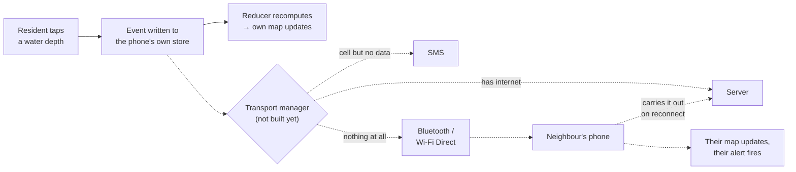
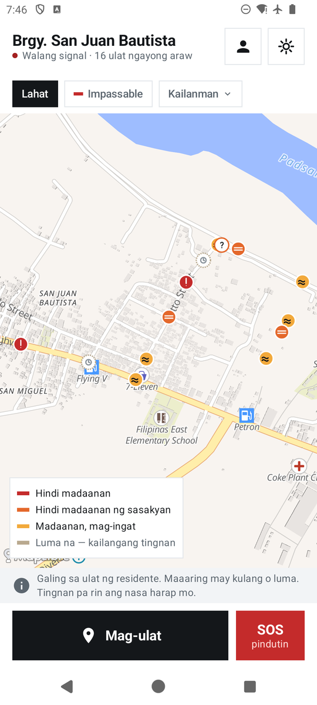
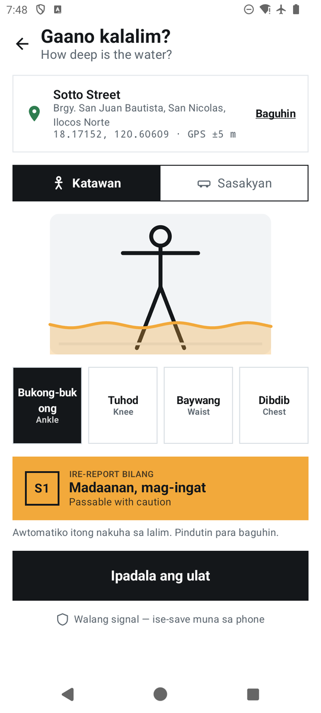
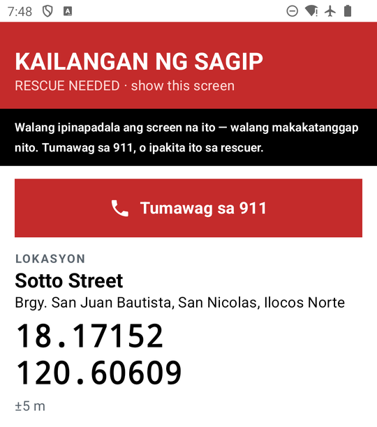

# KaAlerto

**A community flood map and rescue channel for Philippine barangays — built to keep working when the network doesn't.**

Team MACCI · Climate Resilience and Hydrometeorological Disaster Management

---

> **Status: V0 — the offline core.** The map, reporting, confirm/dispute, the reducer, local notifications, filters and Storm Mode work on the phone with the network off. Phone-to-phone relay, SMS, server sync and SOS delivery are designed but **not built yet**. See [what works in V0](#what-works-in-v0) and [what doesn't yet](#what-doesnt-work-yet).
>
> **[Download the V0 APK →](https://github.com/afjk-x3/ka-alerto/releases/latest)**

---

## The idea

Every flood app dies when the towers do. This one is designed not to.

The Philippines takes about twenty typhoons a year, and when a severe one lands the cell towers congest or fall — which is exactly the hour a warning matters most. Every cloud-based early-warning app goes dark at that moment. KaAlerto is built the other way round.

**The phone is the source of truth.** It holds its own copy of the data and computes its own map. In the full design a server aggregates and accelerates, but never decides what's true: the phone already knows, and the server exists to help phones learn about each other.

- **A deterministic reducer** — *built in V0.* Two devices holding the same events display the same map. That's what makes an offline phone trustworthy rather than merely stale.
- **Notifications fire locally** — *built in V0.* The phone checks its own home radius on every new report. No push server, no signal, and the alert still fires.
- **Reporting takes about fifteen seconds and no typing** — *built in V0.* Tap a depth on a body scale (ankle, knee, waist, chest); severity is derived, not chosen.
- **Three transports, tried in order** — *designed, not built yet.* Server sync, then SMS, then phone-to-phone over Bluetooth and Wi-Fi Direct. The relay only has to reach *one* connected phone — someone driving to higher ground carries the whole neighbourhood's data out with them.
- **No forecasting.** Every condition on the map was observed by a person who was standing there. This carries warnings; it does not predict them.

> **Put the phone in airplane mode and it still works.** For V0 that means one phone: its own map, its own reports, its own alerts. Getting a report from one offline phone to another is the next stage.

---

## The flow

This is the target architecture. **V0 is the left half:** a report goes into the phone's own store, the reducer recomputes, and the phone's own map and home-radius alert update. The transport manager and everything to its right is not built yet.

The report is useful the instant it's written — before any transmission is attempted. Everything after that is delivery, and delivery is designed to degrade in fidelity rather than switch off.

**The end-to-end story the finished app is built toward:**

1. Phone A files a report in airplane mode. It appears on A's own map immediately. **← works in V0**
2. Phone B receives it over Bluetooth — no internet, no cell service, no server. *(not built yet)*
3. Phone C receives it *via B*, which was never in range of A. That's the relay carrying. *(not built yet)*
4. Two neighbours disagree about a road: the map shows the disagreement and treats it as dangerous, rather than averaging them or picking a winner. **← works in V0**, with sample reports on one phone
5. Someone long-presses SOS. A responder two streets away gets a critical alert and acknowledges — and the acknowledgement returns down the same chain to a phone that has never had a signal. *(not built yet — V0's SOS is local only, see below)*
6. One person reaches signal. Everyone's queued data uploads at once, and the LGU dashboard finally sees the night the barangay just had. *(not built yet)*

---

## What works in V0

Everything below runs on the phone with airplane mode on, once the map has downloaded.

- **Offline map** of the demo area — Barangay San Juan Bautista, San Nicolas, Ilocos Norte — downloaded once with internet (about 7 MB), then drawn with no network at all.
- **Sample reports.** 19 fictional reports on real, OpenStreetMap-sourced streets, labelled in the app as samples ("Halimbawang ulat"), never as a neighbour's report. Their times are set relative to when the app starts, so the demo always shows the same picture.
- **Reporting.** GPS, or tap a spot on the map; pick a depth on a body or vehicle scale; severity is derived and can be overridden. Saved on the phone instantly, and the place is named from the bundled street data ("Sotto Street, Brgy. San Juan Bautista …").
- **Confirm or dispute** a report ("Tama" / "Iba na", with a reason), and a **deterministic reducer**: weight by role × proximity × time decay, a lone "it's fine now" cannot clear a red road, and genuine disagreement shows as a purple **SX — conflicting** marker instead of being averaged away. Confidence buckets and stale ("luma na") states.
- **Home radius alerts.** Long-press to set home and drag a radius; a new report inside it raises a local notification — no push server.
- **Filters** by severity and recency (1h / 3h / 24h / all), and a **Storm Mode** dark theme.
- **Registration**: first name, surname and home barangay, all required. Self-declared and never checked; reports show only "Juan D." (the surname's initial), and a name never raises a report's confidence.
- **SOS, local only.** A rescue screen that says on its face that it sends nothing: a button that opens the dialer with 911, a high-contrast rescue card with coordinates, name and a plain-text QR code any camera can read, an alarm tone and a screen strobe.
- Filipino interface; all times in Philippine time.

## What doesn't work yet

- **No phone-to-phone relay, no SMS, no server sync.** A report stays on the phone that made it. The server in [`server/`](server/) exists and is tested, but the app does not talk to it yet.
- **SOS does not reach anyone.** No request is delivered and there is no acknowledgement; the screen says so.
- **No roles** — responder and barangay-official accounts, verification and reversal are not in V0.
- Evacuation centres, routes, family check-in, photos and the LGU dashboard are not in V0.
- **One demo area.** Outside San Nicolas the map still opens on the demo area; the app tells you so when your GPS is elsewhere. The area's boundary is a bounding box around two agreeing centroid sources, not a surveyed barangay boundary.
- Tested on one Android 14 emulator and one real phone. No field measurement of anything — relay range, battery, delivery rate.
- The Filipino copy has not been reviewed by a native speaker, and the demo area is Ilocano-speaking.

---

## Screenshots

Real V0 screens from the app.

| Map | Report | SOS (local only) |
|:---:|:---:|:---:|
|  |  |  |
| Offline, sample reports on real streets. The purple "?" is a road two reports disagree about. | Tap a depth; severity is derived. The place is named from bundled street data. | Says plainly that nothing is sent. Opens the dialer with 911; the card is for showing a rescuer. |

The full target design — 29 screens across Normal, Storm and Survival modes, including many not built yet — is in [`design/`](design/) (see the [screen index](design/README.md)).

---

## Try it

1. Download the APK from the [latest release](https://github.com/afjk-x3/ka-alerto/releases/latest).
2. Sideload it (Settings → allow installs from unknown sources).
3. Open it **once with internet** and wait for the map download to finish.
4. Allow location and notifications, and register (or tap SOS to skip straight to the rescue screen).
5. Turn on airplane mode, force-close the app, reopen it — the map, the reports and your own new reports all still work. That's the point.
